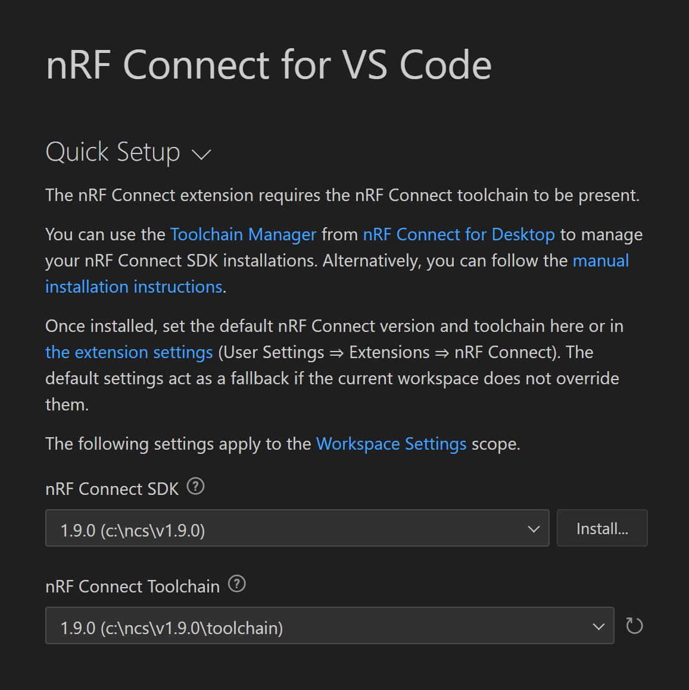
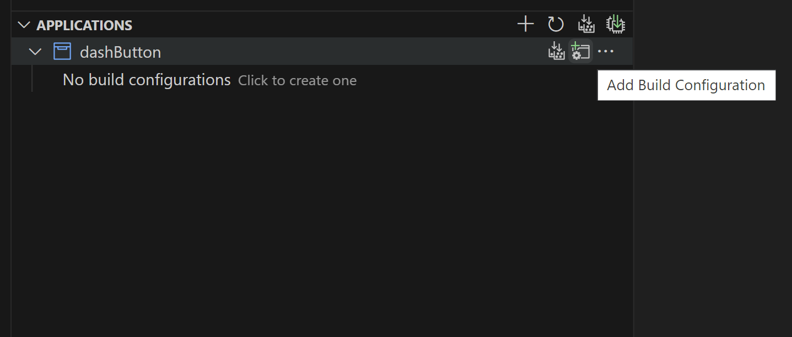
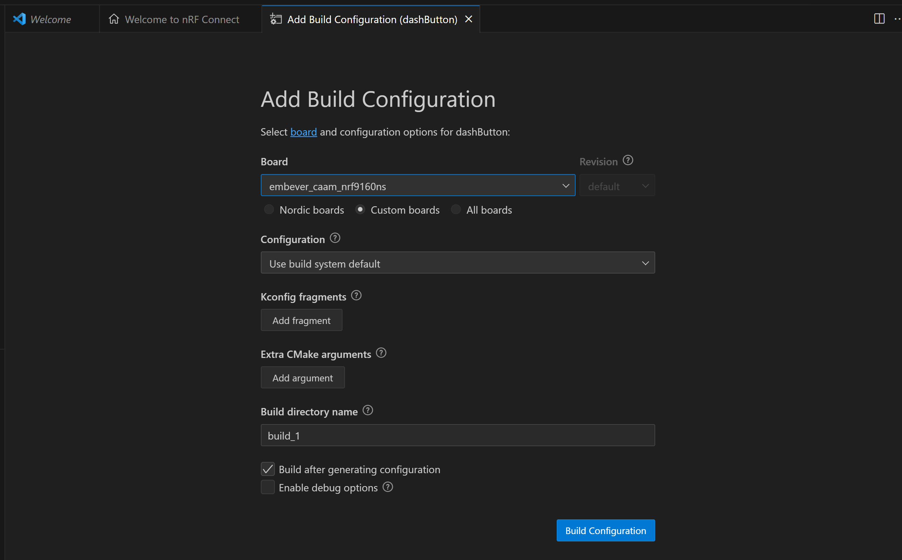

# User Application Framework     
 
The User Application Framework(UAF) is a powerful library designed specifically for programming the [Embever CAAM board](https://www.embever.com/cloud-as-a-module).  The board usually comes with a preinstalled firmware to manage the communication between your custome embedded device and the cloud, but there is a possibility to reprogram it with your desired firmware.  
The UAF is built to give you the flexibility of using Embever Cloud as a Service alongside the other parts of the CAAM board like GPIO, I2C and GPS. In this case even there is no need to a second board for handling your embedded device.  
   
    
## Table of contents
1. [Requirements](#requirements)  
2. [Setup](#setup)  
    * [Install nRF Connect SDK](#install_nrf_connect_sdk)
    * [Project Configuration](#project_configuration)
3. [API Documents](#api_documentation)  
    * [Basics](#basics)
    * [GPIO](#gpio)
    * [Messaging](#messaging)
    * [GNSS](#gnss)
  <!-- TODO: Add links here after finishing reviewings.-->
4. [Sample Projects](#sample-projects)
    * [Dash Button](#dash-button)
    * [Freefall Detection](#freefall-detection)
    * [Temperature Monitoring](#temperature-monitoring)

<br/>

<a id="requirements"></a>
## Requirements  
----
* Embever CAAM Board
* Visual Studio Code
* nRF Connect for Desktop

<br/>

<a id="setup"></a>
## Setup
----
 
<br/>

<a id="install_nrf_connect_sdk"></a>
### Install nRF Connect SDK  
At the moment, the UAF is using nRF Connect SDK Version 1.9.0.  
1. [Download](https://www.nordicsemi.com/Products/Development-tools/nRF-Connect-for-Desktop/Download#infotabs) a package of nRF Connect for desktop that suits your operating system (OS) and install it.
2. After the installation of nRF Connect for desktop, make sure to select and install the following components:
    - Programmer
    - Toolchain Manager
3. Open __Toolchain Manager__.
4. In __Toolchain Manager__, locate and install __nRF Connect SDK v1.9.0__.  
 
<br/>
 
<a id="project_configuration"></a>
### Project Configuration
Follow these steps to set up the software environment:

1. Open Visual Studio Code and open the folder which contains the source code.
2. In the left menu select __nRF Connect__.
3. In __WELCOME__ select first item __Open welcome page__.
4. Select the version of nRF SDK.
    
    <br/>

    

    <br/>

5. Under the __Applications__ menu add a build configuration.

    <br/>

    

    <br/>

6. In the __Board__ menu select Embever CAAM board in None Secure mode. Then click on __Build Configuration__ button.

    <br/>

    

    <br/>

7. Now you can connect your board to the USB port of your device. After that you can see the device under __CONNECTED DEVICES__ menu.
8. Click on __Flash__ under __ACTIONS__ menu to flash the program on the board.
 
<br/>

<a id="api_documentation"></a>  
## API Documentation  
----

<br/>
 
<a id="basics"></a>
### Basics  

---- 
```c 
bool usr_isHostReady()  
```  
Verify network connection.   

* __output__   
   > `bool` : Returns true if the device's connection is successfully established.

<br/>
<br/>
 
<a id="gpio"></a>
### GPIO

----
```c
void ebv_pinMode(uint8_t pin, bool isOutput)
```
Set the mode of a GPIO pin as either input or output.

* __inputs__
   > `uint8_t pin` : The pin number as per the datasheet.  
   > `bool isOutput` : Set this value to `true` if you want to configure the pin as an output pin.  

Example : `ebv_pinMode(13, false)` This code configures pin P0.13 as an input pin.  

----
```c
void ebv_digital_write(uint8_t pin, bool state)
```

* __inputs__
   > `uint8_t pin` : pin number according to the datasheet.  
   > `bool state` : Select the high or low state for the pin.   

----
```c
bool ebv_digital_read(uint8_t pin)
```
Set the digital state of a GPIO pin.  

* __input__
   > `uint8_t pin` : The pin number as per the datasheet.  

* __output__
   > `bool` : Select the desired state for the pin (high or low).   

<br/>
<br/>
 
<a id="messaging"></a>
### Messaging

---
```c
bool ebv_iot_initGenericEvent(char * evnt_type)
```
The initial step to create an event is to define the event type. The event type can be any arbitrary string.  

* __input__

	> `char * evnt_type` : Pointer to a character sequence representing the event type.  

* __output__

    > `bool` :  The function always returns `true`.  

---
```c
bool ebv_iot_addGenericPayload(char * key, value)
```
Events consist of payloads that are represented as key-value pairs. This function adds a new payload to the event.

* __inputs__

    > `char * key` : The key is a character sequence that indicates the type of payload.  
	
    > `value` : The data to be sent to the cloud. The value can be of type `unsigned int`, `int`, `float`, `double`, `char*`, or `char`.

* __output__

    > `bool` : The function always returns `true`.
	
---
```c
bool ebv_iot_submitGenericEvent()
```
This function is used to send an event that has been constructed using `ebv_iot_addGenericPayload` and `ebv_iot_initGenericEvent`.

* __output__

    > `bool` : Returns `true` if the sending process started successfully.

---
```c
bool ebv_iot_waitGenericEventSent()
```
This function waits for a specified amount of time (60 seconds) for the event message to be sent. If the message is sent successfully within the given time, it returns `true`. Otherwise, it returns `false`.

* __output__
   > `bool` : Returns `true` if the event is sent successfully within 1 minute.

---
```c
bool ebv_iot_isGenericEventSent()
```
Checks if the event sending process is completed.

* __output__
   > `bool` : Returns `true` if the event sending process is completed.
 
<br/>
<br/>
 
<a id="gnss"></a>
### GNSS
----
```c
bool ebv_get_gnss_data(struct usr_gnss_data_s *gnss_data)
```
Retrieves GNSS data and saves it to the specified address. Returns `true` if the GNSS data is successfully obtained.

* __input__
   > `struct usr_gnss_data_s *gnss_data` : The address where the GNSS data (latitude, longitude, and accuracy) will be saved.
* __output__
   > `bool` : Indicates the status of obtaining gnss data.

----
```c
void ebv_get_gnss_status(struct usr_gnss_status_s *gnss_status)
```
Get the current gnss status and used satelites.

* __input__
   > `struct usr_gnss_status_s *gnss_status` : A pointer to the address where the GNSS status data will be stored. The `usr_gnss_status_s` structure has the following parameters:  
		- `bool isTracking` : Current GNSS driver state.  
		- `bool hasFix` : Current GNSS fix state.  
		- `uint8_t sats_tracking` : Number of GPS satellites currently tracking.  
		- `uint8_t sats_using` : Number of GPS satellites currently being used. 

<br/>

<a id="sample_projects"></a>
## Sample Projects
---

You can find sample codes for working with various features of the CAAM board, such as digital GPIO, I2C, and cloud communication, in the following GitHub repository: [ebv_UAF_template](https://github.com/Embever/ebv_UAF_template). These code samples serve as examples to help you understand and utilize these features in your projects.

<br/>

<a id="dash_button"></a>
### Dash Button
----
The Dash Button example is a sample project that involves reading from/writing to gpio pins and sending events to the cloud. When someone pushes the button, it will send an event to the cloud and toggles the LED.

<br/>

The code uses ebv(embever) functions for sending messages to the cloud reading from and writing to digital IOs.
The very first thing is configuring and initializing IO pins, which is done in the code bellow:

```c
ebv_pinMode(USR_BTN_GPIO_PIN, PINMODE_INPUT);
ebv_pinMode(LED_GPIO_PIN, PINMODE_OUTPUT);
```
```c
ebv_digital_write(LED_GPIO_PIN, false);
```

<br/>

In the main loop, The state of button is being checked by reading the voltage level of pin:


```c
ebv_digital_read(USR_BTN_GPIO_PIN)
```

<br/>

After detecting a button press, It is requiered to send an event to the cloud. The next step is making and sending the message.


```c
// Specify the type of event.
ebv_iot_initGenericEvent("userApp");

// Adding payload with a key(src) and a value(dev_board)
ebv_iot_addGenericPayload("src", "dev_board");

// Sending generated message to the cloud.
ebv_iot_submitGenericEvent();
```
<br/>

It is possible to check if the message is sent seccussfully.


```c
if ( !ebv_iot_waitGenericEventSent() ){
    printk("Failed to send event\n\r");
}else{
    printk("Event sent successfully.\n");
}
```
<br/>
<br/>

<a id="freefall_detection"></a>
### Freefall Detection
----
This code sample uses an Embever CAAM Board and an MMA8452Q Accelerometer. The goal is to detect freefall of the board and send an event to the cloud each time it occurs. To accomplish this, we will use the I2C peripheral driver provided in the Zephyr libraries to communicate with the sensor. To integrate the code easily with other usages, The freefall detection is handled via an interrupt.
#### I2C Setup
1. In the .conf file of the project The I2C should be enabled.

    ```
    CONFIG_I2C=y
    ```
	
2. The specifications of I2C peripheral is set in .overlay file:

	```
	&i2c2 {
	```  
	```
	status = "ok";
	```  
	```
		sda-pin = <8>;
	```  
	```
		scl-pin = <9>;
	```  
	```
		clock-frequency = <100000>;
	```  
	```
	};
	```
	
    The __status__ can be __ok__ or __disabled__.
    In this case (When use the __CAAM IoT Arduino Shield__) the SDA pin is P0.8 and SCL pin is P0.9. It depends on which pins did you connect you sensor to.
	
3. Initialize the I2C device in the code. As it is selected in the overlay I2C number 2 is used, but it can be changed.

```  
	struct device *i2c_dev = DEVICE_DT_GET(DT_NODELABEL(i2c2));
	if (!device_is_ready(i2c_dev)) {
		printk("I2C: Device is not ready.\n");
		return;
	}
```  
	
#### Interrupt pin Setup
To setup the Interrupt pin, At first in the .conf, the __GPIO__ should be disabled and enable the __GPIOTE__ flag.
```c
CONFIG_GPIO=n
CONFIG_NRFX_GPIOTE=y
```
In the main part of code, the GPIOTE is connected to the nrfx irq handler. In this code the __GPIOTE0__ is used, but the __GPIOTE1__ is available too. The initialization is checked afterwards.
```c
	IRQ_DIRECT_CONNECT(GPIOTE0_IRQn, 0, nrfx_gpiote_irq_handler, 0);

    if(!nrfx_gpiote_is_init()){
        err = nrfx_gpiote_init(0);
        if (err != NRFX_SUCCESS) {
            printk("%d\n", NRFX_SUCCESS);
            printk("nrfx_gpiote_init error : %d\n", err);
            return;
        }
    }
```
The interrupt specifications is set as a RISING edge with an internal pulldown resistor on the pin.
```c
nrfx_gpiote_in_config_t const in_config = {
		.sense = GPIOTE_CONFIG_POLARITY_LoToHi,
		.pull = NRF_GPIO_PIN_PULLDOWN,
		.is_watcher = false,
		.hi_accuracy = true,
		.skip_gpio_setup = false,
	};
```
The pin number and the ISR function is assigned to the interrupt.
```c
nrfx_gpiote_in_init(INPUT_PIN, &in_config, acc_isr);
```
```c
void acc_isr ( void * arg ) {
  ff_detect = true;
}
```
And the interrupt event is enabled for the corresponding pin which is defined as P0.13.
```c
nrfx_gpiote_in_event_enable(INPUT_PIN, true);
```
#### Accelerometer Setup
There is a acc.h library provided as a minimal package to manage the freefall detection of this sensor.  
To initialize the MMA8542Q accelerometer, the code reads the __WHO_AM_I__ register of the sensor, then sets it to standby mode. To change the control registers and do configurations it is necessary to put the sensor on te standby. Afterwards the sensor will be activated.
```c
if(!acc_init(i2c_dev)){
    // Accelerometer not responding
    printk("ACC init error\n");
    return;
}
  
acc_setting(i2c_dev);
acc_activate(i2c_dev);
```
#### Handling event
As sending a message maybe time consuming and the isr should be kept as short as possible, the __ff_detect__ flag is defined for keeping the freefall detection status and in the main loop It is checked to send an event to the cloud.
```c
volatile bool ff_detect = false;
```
The process of making and sending message is explained in the dash button project.

<br/>
<br/>

<a id="temperature_monitoring"></a>
### Temperature Monitoring
----
This code sample uses an Embever CAAM Board and an MCP9808 temperature sensor. It monitors the temperature and if it is not between numbers defined in the code, It sends an alarm to the cloud.

In the .conf file of the project The I2C should be enabled.

```c
CONFIG_I2C=y
```
The specifications of I2C peripheral is set in .overlay file:
```c
&i2c2 {
    status = "ok";
    sda-pin = <8>;
    scl-pin = <9>;
    clock-frequency = <100000>;
};
```
The __status__ can be __ok__ or __disabled__.
In this case (When use the __CAAM IoT Arduino Shield__) the SDA pin is P0.8 and SCL pin is P0.9. It depends on which pins did you connect you sensor to.  
Initialize the I2C device in the code. As it is selected in the overlay I2C number 2 is used, but it can be changed.  
```c
const struct device *i2c_dev  = DEVICE_DT_GET(DT_NODELABEL(i2c2));
```
At first the sensor is initialized and checked if it is working OK.  
```c
if(!mcp9808_init(i2c_dev)){
    printk("connecting to sensor...\n");
    return;
}
```
In the loop the sensor is being checked once a second. If there is a change in the state of temperature and it's not between the minimum and maximum number it will send an event to the cloud.  
In the message it is specified whether the temperature is under the minimum or above the maximum temperature.  
```c
ebv_iot_addGenericPayload("alaram", 
    sensor_state==high?"high_temperature":"low_temperature");
```
