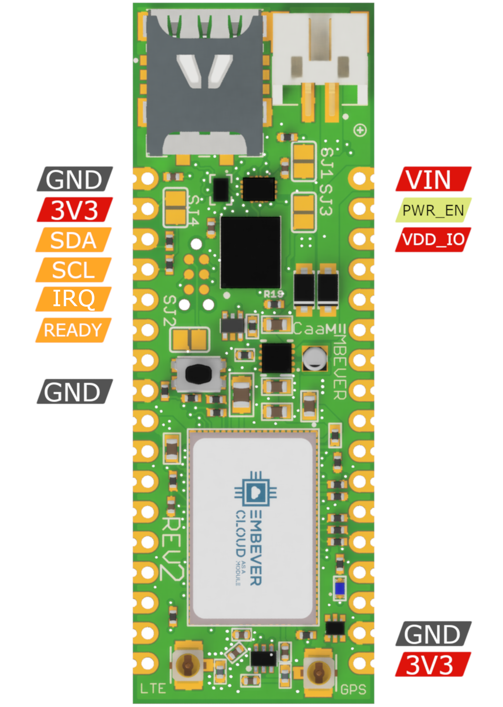

## The Embever CaaM development board

In the process of getting to know the CaaM board, let it start with a
feature highlight.

-   **1** Battery connector, JST2B 2mm pitch
-   **2** nanoSIM adapter
-   **3** Cellular antenna connector, U.FL
-   **4** GPS antenna connector, U.FL
-   **5** Reset button
-   **6** Status indicator LED, blue
-   **7** SIM chip, eSIM
-   **8** Buck/Boost voltage regulator circuitry
-   **9** GPS/LTE modem, LTE-M1, NB-IOT

## Recommended Operating Conditions

  Property                  | Min             | Max              | Unit |
  -----------------         | ----------------| ---------------- | -----|
  Operating Voltage         | 1.8             | 5.5              | V    |
  VDD_GPIO                  | 1.8             | 3.6              | V    |
  Operating Temperature     |-20              | 85               | °C   |
  Peak Power Consumption    |                 | 1                | A    |
                                             

## Jumper Configuration

Solder jumpers can be used to modify the behavior of the hardware. The
location of these solder jumpers are shown in the following figure:

The solder jumpers have the following functionalities:

*Solder Jumpers*

| Solder jumper                     | Functionality                     |
------------------------------------|------------------------------------
| SJ1                               | Short to activate the external SIM card If this solder jumper is shorted, the modem starts using the nanoSIM instead of the eSIM.   |
| SJ3                               | Short to set the GPIO logic level to 3.3V. There is the option to select the voltage level of the GPIO pins, which can be anything between 1.8v and VCC. It can be useful when you wish to interface with a device which is running on a lower voltage level than 3.3v. |
| SJ2                               | Short to connect the board VCC with the TAG connector VCC pin. It might be required by an external programmer if the firmware of the modem is to be updated manually. |
| SJ4                               | Short to activate pullup resistors on i2c lines. The pullup resistors are necessary to communicate with the device. Use external pullup resistors if you do not wish to use the internal ones.|

## Wiring up the hardware

For using the Embever CaaM development board, it has to be connected to
an external device. To establish digital communication with the CaaM
development board, there are a few necessary signals that need to be
connected. The following figure shows the location of these signals by
board versions:

??? "CaaM board revision 2"

    

    

    
    *ESP Pinout*

    Signal Name                         |Description
    ----------------------------------- | -----------------------------------
    VIN                                 | Supply Voltage input
    GND                                 |Ground
    PWR_EN                              |Enable power, active LOW, enabled by default
    VDD_IO                              |Supply Voltage for GPIO Pins
    3V3                                 |Internal voltage regulator output
    SDA                                 |ESP data line
    SCL                                 |ESP clock line
    IRQ                                 |ESP logic line, active low
    READY                               |ESP logic line, active high

    

    

??? "CaaM board revision 2.1"
    

    

    *ESP Pinout*

    Signal Name                         | Description
    ----------------------------------- |----------------------------------
    VIN                                 | Supply Voltage input
    GND                                 | Ground
    PWR_EN                              | Enable power, active LOW
    VDD_IO                              | Supply Voltage for GPIO Pins
    3V3                                 | Internal voltage regulator output
    SDA                                 | ESP data line
    SCL                                 | ESP clock line
    IRQ                                 | ESP logic line, active low
    READY                               | ESP logic line, active high

    

## Powering the Embever CaaM development board

There are multiple ways to supply the Embever CaaM development board.
The JST connector can be used to attach an external battery. The VIN pin
can also be used to supply power from the pin header. The specification
that needs to be considered is the input voltage range that the CaaM
development board can safely use and the current delivery capability of
the external power source. To get those values, take a look at the [Recommended Operating Conditions](#recommended-operating-conditions).

On the other hand, the CaaM development board can also be used to
provide power output through the 3V3 pin. It can provide 3.3 Volt to an
external device (150mA max).

## Digital communication logic level

It is necessary to match the logic level between an external device and
the Embever CaaM development board to establish stable communication.
This is possible by supplying any voltage in the supported voltage range
to the VDD_IO pin. To omit the wiring for this pin, the SJ3 solder
jumper can be used to set the logic voltage level to VCC which is 3.3
Volt.

## Communication with the Embever CaaM development board

To address digital communication with the Embever CaaM development board
a lightweight protocol is used, the Embever Serial Protocol (ESP). For
more information about it, see [Embever Serial Protocol Driver](../embever-iot-library/api/esp_drv)

To use the Embever Serial Protocol, connect an external device based on
the following table:

  *ESP Wiring*
  
  Signal name                        | Description
  -----------------------------------| -----------------------------------
  SDA                                | Serial Data
  SCL                                | Serial Clock
  READY                              | Device ready to receive
  IRQ                                | Data available to read

  

!!! note

    Make sure to use an Arduino board that fulfils the voltage level
    requirements. The Embever CaaM board is not 5V tolerant. For example,
    to be able to use an Arduino UNO board, a voltage level shifter might
    be necessary.
