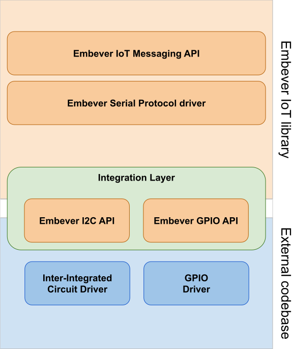

# API documentation

**Current stable version:**

The API documentation aims to describe the working principles of the
library. Showing how to use it and how to interact with it by providing
description about each modules with examples and hinting
recommendations.

<figure>

<figcaption>The Embever IoT library stack</figcaption>
</figure>
