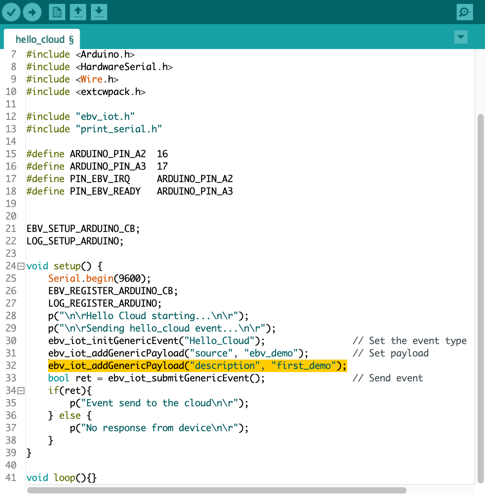

# Getting Started

This document serves as a guide through the basic steps that are
necessary to start building IoT applications with the Embever Cloud as a
Module Development Kit and gives a brief overview of our stack. The goal
is to provide just enough information to be able to get familiar with
the IoT world without being too overwhelming. To be able to complete
this guide, an Arduino compatible hardware will be necessary.

## Embever IoT software library

To make it even simpler, Embever provides an additional software library
that handles the ESP on its own. There is no need to fully understand
our protocol and implement a custom software library to be able to use
the Embever CaaM development board. With this simplicity, starting to
work on an IoT application was never that easy, without the heavy
proprietary communication protocol handling. The Embever IoT software
library is platform-independent and does not contain any peripheral
drivers. In this way, it can be easily integrated into any existing
environment. To create sample applications, we chose the Arduino
framework to make communication possible between an external device and
the Embever CaaM development kit. In our mind, the Arduino Framework is
a great tool to show how things work and the idea is easily adaptable to
other platforms as well.

## Summary

To summarize the above topics before starting to work with the examples:

-   Configure the hardware by shorting the right solder jumpers
    based on the required behavior
-   Connect the CaaM board with an external device
-   Supply power to the system, the easiest way is to use a lithium
    polymer battery with a JST connector

## Introducing the Embever Cloud System

Embever IoT Core is responsible to handle all messaging to and from a
device. The Embever IoT Core provides an API to easily send and receive
data from a device. Besides this, it can also be used to manage
resources like devices and firmwares.

### Activating the Embever Account

When an order is submitted for the Embever Cloud As A Module development
kit, an account is automatically created with the given details and an
email is sent to activate the newly created account. To set up the
account simply follow the link in the received email. With the personal
credentials, logging in to the [Embever Cloud
console](https://console.embever.com) or to the [Embever Cloud Browsable
API](https://api.embever.com) is now possible.

To manage the resources use the Embever Cloud Browsable API. Go to the
<https://api.embever.com/v2/devices/> where all the personal devices
should be listed.

### Connecting the device to the Embever Cloud System

## Setting up the Arduino environment

The Arduino IDE is a well known integrated development environment to
support all kinds of Arduino compatible devices. The Arduino IDE needs
to be installed in order to compile the Embever IoT library. Moreover
there are 2 necessary modifications that need to be done on the Arduino
Wire library before it would be usable to work with the Embever IoT
library. The Embever IoT library needs to send longer messages that the
default Arduino Wire library can handle. The easiest way to locate them
is to get information about the Arduino Core library location. The
Arduino IDE carries this information under the Preference sub menu.

The following path shows the location of the arduino core. Using this
example, in this case the files can found in the following location:
`/Users/macbook/Library/Arduino15/packages/arduino/hardware/avr/1.8.3/libraries/Wire/src/Wire.h`
`/Users/macbook/Library/Arduino15/packages/arduino/hardware/avr/1.8.3/libraries/Wire/src/utility/twi.h`

| Note: This location will vary on other systems!

Change the following lines according to the following:

 *Wiring library modifications*

  File              |Location         |Change from                      |Change to
  ----------------- |-----------------|-------------------------------- |---------------------------------
  `Wire.h`          |line 29           |`#define BUFFER_LENGTH 32`       |`#define BUFFER_LENGTH 128`|
  `Twi.h`           |line 34           |`#define TWI_BUFFER_LENGTH 32`   |`#define TWI_BUFFER_LENGTH 128`|

With this modification, the Embever IoT library will be able to send the
right messages over I2C.

## Setting up the Embever IoT library in Arduino IDE

To be able to use the Embever IoT library, it need to be installed to
the Arduino IDE first. The Embever IoT library is depends on the CWPack
library.

Download the libraries from the following links by the download source code button and select the .zip option:

-   [Embever IoT
    Library](https://gitlab.com/embever-public/embever-iot-library)
-   [CWPack Library](https://gitlab.com/embever-public/cwpack)

Add the downloaded files to the Arduino IDE:

-   1 Open Arduino ID
-   2 Select: `Sketch / Include Library / Add .ZIP Library…`
-   3 Add both downloaded files in this way

To open an example from the Embever IoT library from the Arduino IDE
select `File / Examples / Embever IoT Library / Hello_Cloud`. Compile
the Sketch and Upload to the device and open the Serial Terminal from
the Arduino IDE to see the logs.

To see the result in the Embever Cloud System go to the Browsable API.

## Modifying the Hello_Cloud example

Extending the Hello_Cloud example is a great way to get familiar with
the Embever IoT library and with the Embever Cloud System. Let's extend
the existing payload by adding another key value pair to it. Add the
following line just under line 31:
`ebv_iot_addGenericPayload(\"description\", \"first_demo\");`

Verify the result in the cloud system after the sketch was uploaded to
the device. Working with the Embever IoT solution is fun because it has
a lot of potential to build and deploy the IoT applications of the
future. To see more examples, dig deeper in the library and read about
the whole API, check the Embever IoT library documentation here.
