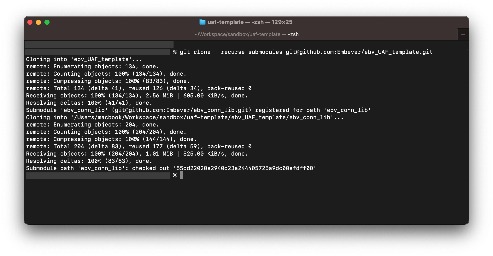

# CaaM Application Framework
The CaaM Application Framework (UAF) is a framework which provides a rich set of APIs to rapidly build IoT applications with out of the box connectivity to the [Embever IoT Core](../links/embever_iot_core.md).
It offers a simple to use API, provided by UAF to send for example telemetry data to the cloud with just a few lines of code without thinking about the implementation of different protocols for connectivity, secure communication and other changing tasks of IoT applications.
To know more about the User Application Framework API refer to [UAF API Documentation](../links/uaf_api.md)

## Sending telemetry data to the cloud using the UAF
In the scope of this quick start guide, an example application will demonstrate how to send device telemetry to the cloud. To see the telemetry data the [Embever IoT Core Browsable API](../links/iot_core_browsable_api.md) shall be used.

### Prerequisites

This guide will require the following things to fully complete it:

- An active account for the Embever IoT Core, see [Creating Embever IoT Core Account](/tutorials/console/account_mgmt)
- A supported hardware device with SIM card provided by Embever, see [Supported hardware devices](./supported_hardware)
- Visual Studio Code installed in your development machine (optional but recommended)

## Sign in to Embever IoT Core Browsable API
Sign in to the [Embever IoT Core Browsable API](https://api.embever.com/).
Keep the portal open during processing the this guide.

## Make sure the  a SIM card is allocated to the right organization
To list the available SIM cards, got to the [SIM resource](https://api.embever.com/v2/sims/) endpoint.
Make sure that the SIM that the CaaM device is using is in the list of and it is activated. The easiest way to achieve that is to check the `iccid` attribute of the SIM resource with the ICCID of the physical SIM card that the CaaM device is using. 

## Create a Device in the Embever IoT Core
A Device instance in the Embever IoT Core is the representation of a single physical IoT device.

!!! Note

    If the CaaM Development Kit had provided by Embever, there is a good chance that the device is already created in the Embever IoT Core. To list the available devices, go to the [https://api.embever.com/v2/devices/](https://api.embever.com/v2/devices/) endpoint. This means the content of this section can be skipped.
    <a href="https://api.embever.com/v2/devices/">Devices API Endpoint </a>

The simples way to create a device is to use the Browsable API. However, any other tool can be used like Postman or curl. In this guide the Browsable API will be used the perform the task.

- Visit the [https://api.embever.com/v2/devices/]([https://api.embever.com/v2/devices/]) endpoint. Make sure to log in with the right account credentials.
- Goto the bottom of the page, until reaching a form to input device data. Both HTML and raw input formats are available to initiate a post request which will create a new device. The raw data format is used for this example.
- On the Raw Data set the Media type field to application/json.
- On the content field. Put the  following.
```
{
    "name": "<your_device_name>",
    "activated": true,
    "sims": ["<iccid_of_sim>"]
}
```
For this example only the required fields are set. For further details, see the [Embever IoT Core REST API documentation](/references/rest_api).
Replace `<your_device_name>` with a unique name, the name of the Device should be unique within the organization. Replace `<iccid_of_sim>` with the ICCID of the SIM card that the CaaM device is using.
- Click the POST button. This will create a device in the Embever IoT Core. As a result, a similar object will be returned.
```
{
    "url": "https://api.embever.com/v2/devices/4w4QD/",
    "id": "4w4QD",
    "name": "<your_deivce_name>",
    "password": "**********************",
    "activated": true,
    "application": null,
    "webhooks": null,
    "meta": null,
    "sims": ["<iccid_of_sim>"],
    "created_at": "2024-06-14T07:37:23.361080Z"
}
```
With that done, the device had been created and it is ready to receive the telemetry data from the CaaM device.

## Run the Sample Application

The CaaM Application Framework is designed to simplify and speed up IoT product development. This framework delivers essential IoT functionalities out of the box, eliminating the need for developers to implement them from scratch. With built-in support for telemetry data transfer, file transfers, firmware updates, and more, the framework handles complex connectivity, protocol management, and security implementations, allowing to be focused on creating applications.
To read more about the CaaM Application Framework, see [CaaM Application Framework](/concepts/app_framework).
To see the toolkit in action, a sample application will demonstrate the use of the CaaM Application Framework.

### Step 1: Setting Up the Software Development Environment



### Step 2: Get a local copy of the Embever User Application Framework Template

To get a local copy of the of the CaaM User Application Framework template, clone the repository listed below, or use the distributed archive.

!!! note

    Note, this repository contain submodules which are necessary for its operation.

Use the following command to make sure that the submodules are downloaded as well.*

`git clone --recurse-submodules git@github.com:Embever/ebv_UAF_template.git`



The CaaM Application Framework Template contains sample applications under the `./samples` folder. In this quickstart we will work with
`<application name>`. This application sends sample telemetry data from your Device to the cloud.
<!-- TODO: Update info sample applicaiton -->

### Step 3: Working with the UAF template



### Step 5: Crypto keys for binary encryption



### Step 6: Build and Flash



<!-- TODO: Tutorial/Guide: 
    How to flash the binary to CaaM Mini.
    How to flash a firmware on nordic DK. -->

### Step 7: Run the sample Application on your IoT Device
.........
<!-- TODO -->


## View sent telemetry data in Embever IoT Core Browsable API
Embever IoT Core REST API lets you interact with the devices on the {{UAF}}. We will use the Browsable API to see the telemetry data sent by the device.
On your browser go to `https://api.embever.com/v2/events/?device=<your_device_id>`. Replace `your_device_id` with the id of your Device in the API. Events are the representation of data that is sent from the device to Embever IoT Core. Event object contains a type which denotes an specition occurence in the device and the payload contains the additional information of this occurence. In our case the telemetry data is sent as the payload of occurence of the event "<type>".
Now you should see the telemetry data un like this.
<!-- 
We can be creative on what type of sample application we have, something that is more common for users and easy to understand -->
```
    [
        {
            "url": "https://api.embever.com/v2/events/123456/",
            "id": 123456,
            "device": "my-test-dev",
            "sim": "8988XXXXXXXXXXX",
            "type": "samples",
            "payload": {
                "temp": 20
            },
            "created_at": "2024-06-05T14:44:38.497395Z"
        }
    ]
```

Furthermore, {{UAF}} provides and easy way to automatically send these telemetry data to any cloud application. See [How to send data from Embever IoT Core to you application](/tutorials/integrations/webhooks)
{{UAF}} also provides an integration with Salesforce and Azure IoT Hub so that the data sent by the Devices can be used on your Business applicaitons. See [Integration with Salesforce](/tutorials/integrations/salesforce) and [Integration with Azure IoT Hub](/tutorials/integrations/azure_iot_hub) for more details.

## Next Steps
.....


<!-- ## Have your hardware/simcard ready
- sim card
- Supported System on Chip (SoC) (Currently the system supports only nRF9160)

Tutorial: Introducing Embever Serial Protocol
Tutorial: Introducing Embever Application Framework

Notes:
Caam OS sends only private events

ESP 

Embever Application Framework-
    Static libaries, private (uneditable) +  public
    Has a user app folder (where the application resides)
    Compile the whole project to get the running application. 

CaaM Mini - 

 You must have a simcard either an e-sim or a normal sim card in your device provided by Embever. This sim card will be used for the cellular connection to send data to the Embever IoT Core.

Step 0: 
    Hardware ready... 
    Can be nRF DK/ Caam Mini / own hardware with SoC and the sim. Caam Mini has an embeded sim,  also has an option to add plastic sim.

Step 1:
- Setup the environment Nordic Connect SDK.
    https://github.com/Embever/embever_docs/blob/hardware/docs/tutorials/embedded/uaf/uaf_env_setup_guide.md

- Clone Application Framework repository from Embever 
https://github.com/Embever/ebv_UAF_template

- Take the Sample Applications part of the UAF template 
e.g. hello cloud
    change something values..
    The point here is to show how the user can send telemetry data from the applicaiton.
    The user doesnot need to change the sample script but know how to call the api looking at the example.
    send_event("<key>", "<value>")
    Change the values to whatever telemetry data you want to send. Replce Key with "temp", value with "27"


build the sample application
 - 

Flash the binary to your SoC
    Tutorial/Guide: How to flash the binary to CaaM Mini.
    How to flash a firmon nordic DK.

Check in your Browsable api

Another option:
Provide pre build binary, upload to the hardware. Can be with sample applications. Flash the binary and see the results.


ESP
- protocol definition

ESP and AF
ESP app itself is an application that implements the ESP protocol.


AF might be too overwhelming, can make use of the ESP tool.

# Sign in to Embever IoT Core
## Make sure you have a sim card allocated to your organisation
You can see the list of available sim cards in the browsable api under the link https://api.embever.com/v2/sims/.
Make sure the iccid of the sim that you have in your device is there in the list of sim cards.

E.g.


# Create a Device
You can create the device using the browsable api or from any other tools like postman or curl. To make requests to the api besides the browsable api you will need an application. 

TODO: Tutorial Read this how to get started with use the embever IoT Core api.

Now to create a Device using the Browsable api follow the following steps:

- On your browser open https://api.embever.com/v2/devices/. Make sure you are logged in with your account credentials.
- Goto the End of the page, you should see a form to save device data. You can use either HTML form or Raw Data to make a post request to create a device. We will use Raw Data for this example.
- On the Raw Data set the Media type field to application/json.
- On the content field. Put the  following.
```
{
    "name": "<your_device_name>",
    "activated": "true",
    "sims": ["<iccid_of_sim>"]
}
```
For this example we will set the basic required fields only. You can follow the api documentation for other fields.
Replace "\<your_device_name>" with a unique name, the name of the device should be unique within your organisation. Replace <iccid_of_sim> with the iccid of the simcard that you have on your device at hand.

Now, click the `POST` button on the bottom.

You should now see the details of the device created like this

TODO: <example>

TODO: <screenshots>


# Update the Frimware with User Application Framework

# Send Events (Telemetry Data)

# View Events -->