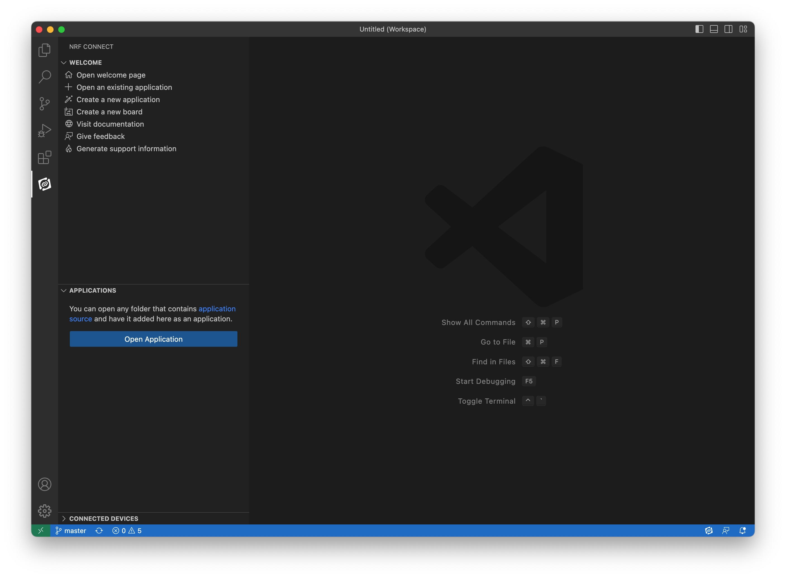

# User Application Framework
User Application Framework commonly refered as UAF is a framework which provides a rich set of APIs to rapidly build your IoT applications with out of box connectivity to [Embever IoT Core](../links/embever_iot_core.md). For example, you can simply use the API provided by UAF to send the telemetry data from your application to the cloud with just a few lines of code without thinking about the implementation of different protocols for connectivity, secure communication,etc which is provided out of box.

To know more about the User Application Framework API refer to [UAF API Documentation](../links/uaf_api.md)

## Send telemetry data to the cloud using UAF
In this quickstart, you will use an example application to send device telemetry to the cloud. You will use the [Embever IoT Core Browsable API](../links/iot_core_browsable_api.md) to see the telemetry data. This article shows the basics of how you can make use of UAF to build an IoT application with the cloud connectivity.

### Prerequisites
Befor you begin make sure that you have the following prerequisites fulfilled.

- Make sure you have an Embever IoT Core account before you begin.
See [Creating Embever IoT Core account](../links/embever_iot_core.md#creating-embever-iot-core-account) for details.
- System on Chip supported by {{UAF}} with SIM card provided by Embever. Currently {{UAF}} supports nRF9160 only. You will need a SIM card in the form of e-SIM or simply an external sim provided by Embever to connect to the Embever IoT Core Cloud services. The easiest way to get started is to get Cloud as a Module Development Kit from [here](https://www.embever.com/cloud-as-a-module) which comes up with the supported SoC, embeded sim card and extra pheripherials. Alternatively you can use Development kit like [nRF9160 DK](https://www.nordicsemi.com/Products/Development-hardware/nrf9160-dk).
- Visual Studio code installed in your development machine.

## Sign in to Embever IoT Core Browsable API
Sign in to [Embever IoT Core Browsable API](https://api.embever.com/).
Keep the portal open in your borwser. You use it in this quickstart.

## Make sure you have a sim card allocated to your organisation
You can see the list of available sim cards in the Browsable API under the [SIM resource](https://api.embever.com/v2/sims/).
Make sure the sim that you want to use is in the list of sims and is activated. You can check the `iccid` attribute  of the SIM resource with the ICCID of the sim card that you have with you. 

## Create a Device in Embever IoT Core
A Device instance in Embever IoT Core is the representation of a single physical IoT device. 
!!! Note

    If you are working with CaaM Development Kit provided by Embever, you can skip this section. Embever already created a device for you which you can see it in the list of your devices under [https://api.embever.com/v2/devices/](https://api.embever.com/v2/devices/)
    <a href="https://api.embever.com/v2/devices/">Devices API Endpoint </a>

You can create a Device instance using the Browsable API or from any other tools like Postman or curl or from your own custom script. In this quickstart we will create a Device instance that represents your IoT Device using the Embever Browsable API.

- On your browser open [https://api.embever.com/v2/devices/]([https://api.embever.com/v2/devices/]). Make sure you are logged in with your account credentials.
- Goto the End of the page, you should see a form to save device data. You can use either HTML form or Raw Data to make a post request to create a device. We will use Raw Data for this example.
- On the Raw Data set the Media type field to application/json.
- On the content field. Put the  following.
```
{
    "name": "<your_device_name>",
    "activated": true,
    "sims": ["<iccid_of_sim>"]
}
```
For this example we will set the basic required fields only. You can follow the [Embever IoT Core REST API documentation](/references/rest_api) for further details.
Replace `<your_device_name>` with a unique name, the name of the Device should be unique within your organisation. Replace `<iccid_of_sim>` with the ICCID of the SIM card that you have on your Device at hand.
- Click the POST button. This will create a Device in Embever IoT Core. You should see somthing like this after the Device is scuccessfully created.
```
{
    "url": "https://api.embever.com/v2/devices/4w4QD/",
    "id": "4w4QD",
    "name": "<your_deivce_name>",
    "password": "**********************",
    "activated": true,
    "application": null,
    "webhooks": null,
    "meta": null,
    "sims": ["<iccid_of_sim>"],
    "created_at": "2024-06-14T07:37:23.361080Z"
}
```
Now that you have the representatin of your real physical Device in Embever IoT Core you can now proceed with running a smple applicaiton on your IoT Device to send some telemetry data.

## Run Sample Application on your IoT Device
{{UAF}} offers an Application Framework designed to simplify and speed up IoT application development. This framework delivers essential IoT functionalities out of the box, eliminating the need for developers to implement them from scratch. With built-in support for telemetry data transfer, file transfers, firmware updates, and more, the framework handles complex connectivity, protocol management, and security implementations, allowing developers to focus on creating their applications.
Read more about Application Framework [here](/concepts/app_framework).

We will now see how to use the Application framework to build a sample IoT applicaiton which sends telemetry data to the cloud.

### Step 1: Setup the environment Nordic Connect SDK.
To set up the nRF Connect SDK, follow the official guide written by Nordic Semiconductor team [here](https://developer.nordicsemi.com/nRF_Connect_SDK/doc/latest/nrf/getting_started/assistant.html).
Choose the nRF Connect SDK version 2.2.0 from the Toolchain Manager.

<!-- TODO: update the nordic links, as they will migrate to docs.nordicsemi.com -->

!!! note

    If this version is not listed on the Toolchain Manager, change the setting of the application based on the screenshot below.


!!! note

    If the mentioned SDK version is not listed, turn off the “Show only 3 newest minor version” option on the Toolchain Manager settings page.

To exploit all the possibilities of the development experience, review [this](https://developer.nordicsemi.com/nRF_Connect_SDK/doc/latest/nrf/getting_started.html) page as well.
To verify the local development environment, try to compile and upload one of the nordic sample application.


    https://github.com/Embever/embever_docs/blob/hardware/docs/tutorials/embedded/uaf/uaf_env_setup_guide.md

- Clone Application Framework repository from Embever 
https://github.com/Embever/ebv_UAF_template

### Step 2: Get a local copy of the Embever User Application Framework Template

To get a local copy of the of the CaaM User Application Framework template, clone the repository listed below, or use the distributed archive.

!!! note

    Note, this repository contain submodules which are necessary for its operation.

Use the following command to make sure that the submodules are downloaded as well.*

`git clone --recurse-submodules git@github.com:Embever/ebv_UAF_template.git`


The Application Framework repository already contains some sameple applications to get you started. You can find the sample applicaitons under the folder `/samples`. In this quickstart we will work with
`<application name>`. This application sends sample telemetry data from your Device to the cloud.
<!-- TODO: Update info sample applicaiton -->

### Step 3: Working with the UAF template
<!-- TODO: Change this section to RUN sample application -->

To start working with the UAF template, open the nRF Connect SDK IDE, which is the Visual Studio Code with the Nordic nRF Connect SDK plugin.
To do that, click on the "Open VS Code" button in the nRF Connect Desktop Toolchain Manager.
Importing the UAF template is as simple as clicking to the Open Application button after selecting the nRF Connect extension tab on the sidebar in VS Code.



Opening the UAF template as and existing application by the Open Application button
As the application opened successfully, the next step is to define a build target


!!! note ""
    Build configuration successfully defined, SDK and toolchain version set to 2.2.0

### Step 5: Crypto keys for binary encryption

To embed secure firmware update into the deployment process, the firmware binary has to be signed with a unique key. Ignoring this option and using the default keys of the SDK is not forbidden for internal development, but as soon as the firmware pass the development stage, it is recommended to use a custom keys to maintain security.
!!! note 
    To use the default keys to sign the firmware binaries, remove ( or make the line begin with the `#` sign to disable it) the following line in the `mcuboot.conf` file.

```c
CONFIG_BOOT_SIGNATURE_KEY_FILE="fota-keys/nRF9160/dev/mcuboot-ec-p256.pem"
```

To generate a custom signing keys, follow [this](https://developer.nordicsemi.com/nRF_Connect_SDK/doc/latest/nrf/app_dev/bootloaders_and_dfu/fw_update.html#signature-keys) guide written by the Nordic Semiconductor team.
The newly generated keys can be places to any location and they can be referenced with they absolute path. Using a relative path is also possible ( like the default value of the `CONFIG_BOOT_SIGNATURE_KEY_FILE` ). In this case the base directory of this relative path is the following location:

`<nrf_sdk_base>/<version_number>/bootloader/mcuboot`

*As an example, the absolute location of the signing key is : `/opt/nordic/ncs/v2.2.0/bootloader/mcuboot/fota-keys/nRF9160/dev/mcuboot-ec-p256.pem`*

### Step 6: Build and Flash

To build the application, use the Build Configuration button or use one of the built-in build tasks of the nRF Connect extension.


<!-- TODO: Tutorial/Guide: 
    How to flash the binary to CaaM Mini.
    How to flash a firmware on nordic DK. -->

### Step 7: Run the sample Application on your IoT Device
.........
<!-- TODO -->


## View sent telemetry data in Embever IoT Core Browsable API
Embever IoT Core REST API lets you interact with the devices on the {{UAF}}. We will use the Browsable API to see the telemetry data sent by the device.
On your browser go to `https://api.embever.com/v2/events/?device=<your_device_id>`. Replace `your_device_id` with the id of your Device in the API. Events are the representation of data that is sent from the device to Embever IoT Core. Event object contains a type which denotes an specition occurence in the device and the payload contains the additional information of this occurence. In our case the telemetry data is sent as the payload of occurence of the event "<type>".
Now you should see the telemetry data un like this.
<!-- 
We can be creative on what type of sample application we have, something that is more common for users and easy to understand -->
```
    [
        {
            "url": "https://api.embever.com/v2/events/123456/",
            "id": 123456,
            "device": "my-test-dev",
            "sim": "8988XXXXXXXXXXX",
            "type": "samples",
            "payload": {
                "temp": 20
            },
            "created_at": "2024-06-05T14:44:38.497395Z"
        }
    ]
```

Furthermore, {{UAF}} provides and easy way to automatically send these telemetry data to any cloud application. See [How to send data from Embever IoT Core to you application](/tutorials/integrations/webhooks)
{{UAF}} also provides an integration with Salesforce and Azure IoT Hub so that the data sent by the Devices can be used on your Business applicaitons. See [Integration with Salesforce](/tutorials/integrations/salesforce) and [Integration with Azure IoT Hub](/tutorials/integrations/azure_iot_hub) for more details.

## Next Steps
.....


<!-- ## Have your hardware/simcard ready
- sim card
- Supported System on Chip (SoC) (Currently the system supports only nRF9160)

Tutorial: Introducing Embever Serial Protocol
Tutorial: Introducing Embever Application Framework

Notes:
Caam OS sends only private events

ESP 

Embever Application Framework-
    Static libaries, private (uneditable) +  public
    Has a user app folder (where the application resides)
    Compile the whole project to get the running application. 

CaaM Mini - 

 You must have a simcard either an e-sim or a normal sim card in your device provided by Embever. This sim card will be used for the cellular connection to send data to the Embever IoT Core.

Step 0: 
    Hardware ready... 
    Can be nRF DK/ Caam Mini / own hardware with SoC and the sim. Caam Mini has an embeded sim,  also has an option to add plastic sim.

Step 1:
- Setup the environment Nordic Connect SDK.
    https://github.com/Embever/embever_docs/blob/hardware/docs/tutorials/embedded/uaf/uaf_env_setup_guide.md

- Clone Application Framework repository from Embever 
https://github.com/Embever/ebv_UAF_template

- Take the Sample Applications part of the UAF template 
e.g. hello cloud
    change something values..
    The point here is to show how the user can send telemetry data from the applicaiton.
    The user doesnot need to change the sample script but know how to call the api looking at the example.
    send_event("<key>", "<value>")
    Change the values to whatever telemetry data you want to send. Replce Key with "temp", value with "27"


build the sample application
 - 

Flash the binary to your SoC
    Tutorial/Guide: How to flash the binary to CaaM Mini.
    How to flash a firmon nordic DK.

Check in your Browsable api

Another option:
Provide pre build binary, upload to the hardware. Can be with sample applications. Flash the binary and see the results.


ESP
- protocol definition

ESP and AF
ESP app itself is an application that implements the ESP protocol.


AF might be too overwhelming, can make use of the ESP tool.

# Sign in to Embever IoT Core
## Make sure you have a sim card allocated to your organisation
You can see the list of available sim cards in the browsable api under the link https://api.embever.com/v2/sims/.
Make sure the iccid of the sim that you have in your device is there in the list of sim cards.

E.g.


# Create a Device
You can create the device using the browsable api or from any other tools like postman or curl. To make requests to the api besides the browsable api you will need an application. 

TODO: Tutorial Read this how to get started with use the embever IoT Core api.

Now to create a Device using the Browsable api follow the following steps:

- On your browser open https://api.embever.com/v2/devices/. Make sure you are logged in with your account credentials.
- Goto the End of the page, you should see a form to save device data. You can use either HTML form or Raw Data to make a post request to create a device. We will use Raw Data for this example.
- On the Raw Data set the Media type field to application/json.
- On the content field. Put the  following.
```
{
    "name": "<your_device_name>",
    "activated": "true",
    "sims": ["<iccid_of_sim>"]
}
```
For this example we will set the basic required fields only. You can follow the api documentation for other fields.
Replace "\<your_device_name>" with a unique name, the name of the device should be unique within your organisation. Replace <iccid_of_sim> with the iccid of the simcard that you have on your device at hand.

Now, click the `POST` button on the bottom.

You should now see the details of the device created like this

TODO: <example>

TODO: <screenshots>


# Update the Frimware with User Application Framework

# Send Events (Telemetry Data)

# View Events -->