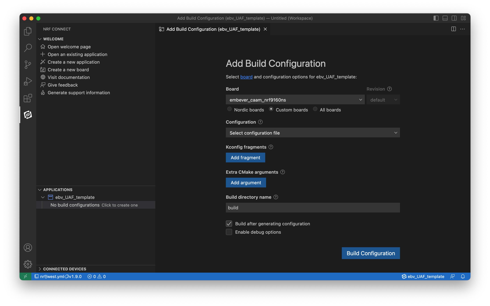
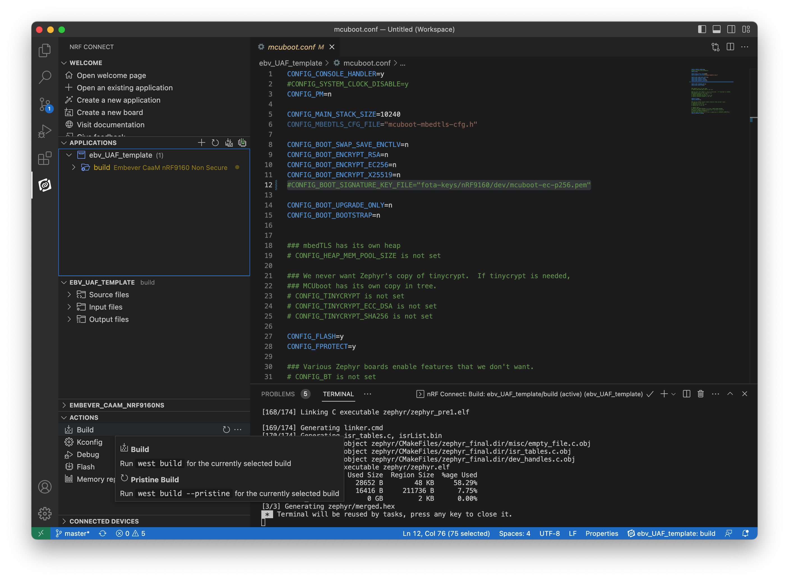

# Setting up the CaaM Application Framework development environment

This tutorial will guide trough the process to set up the development environment to get started with the CaaM Application Framework.

## 1. Step: Setting up the Nordic nRF Connect SDK

To set up the nRF Connect SDK, follow the official guide written by Nordic Semiconductor team [here](https://developer.nordicsemi.com/nRF_Connect_SDK/doc/latest/nrf/getting_started/assistant.html).
Choose the nRF Connect SDK version 2.2.0 from the Toolchain Manager.


!!! note

    If this version is not listed on the Toolchain Manager, change the setting of the application based on the screenshot below.


!!! note ""

    If the mentioned SDK version is not listed, turn off the “Show only 3 newest minor version” option on the Toolchain Manager settings page.

To exploit all the possibilities of the development experience, review [this](https://developer.nordicsemi.com/nRF_Connect_SDK/doc/latest/nrf/getting_started.html) page as well.
To verify the local development environment, try to compile and upload one of the nordic sample application.


## 2. Step: Get a local copy of the Embever User Application Framework Template

To get a local copy of the of the CaaM User Application Framework template, clone the repository listed below, or use the distributed archive.

!!! note

    Note, this repository contain submodules which are necessary for its operation.

Use the following command to make sure that the submodules are downloaded as well.*

`git clone --recurse-submodules git@github.com:Embever/ebv_UAF_template.git`


## 3. Step: Working with the UAF template

To start working with the UAF template, open the nRF Connect SDK IDE, which is the Visual Studio Code with the Nordic nRF Connect SDK plugin.
To do that, click on the "Open VS Code" button in the nRF Connect Desktop Toolchain Manager.
Importing the UAF template is as simple as clicking to the Open Application button after selecting the nRF Connect extension tab on the sidebar in VS Code.


Opening the UAF template as and existing application by the Open Application button
As the application opened successfully, the next step is to define a build target




!!! note ""
    Build configuration successfully defined, SDK and toolchain version set to 2.2.0

## Step 5: Crypto keys for binary encryption

To embed secure firmware update into the deployment process, the firmware binary has to be signed with a unique key. Ignoring this option and using the default keys of the SDK is not forbidden for internal development, but as soon as the firmware pass the development stage, it is recommended to use a custom keys to maintain security.
!!! note 
    To use the default keys to sign the firmware binaries, remove ( or make the line begin with the `#` sign to disable it) the following line in the `mcuboot.conf` file.

```c
CONFIG_BOOT_SIGNATURE_KEY_FILE="fota-keys/nRF9160/dev/mcuboot-ec-p256.pem"
```

To generate a custom signing keys, follow [this](https://developer.nordicsemi.com/nRF_Connect_SDK/doc/latest/nrf/app_dev/bootloaders_and_dfu/fw_update.html#signature-keys) guide written by the Nordic Semiconductor team.
The newly generated keys can be places to any location and they can be referenced with they absolute path. Using a relative path is also possible ( like the default value of the `CONFIG_BOOT_SIGNATURE_KEY_FILE` ). In this case the base directory of this relative path is the following location:

`<nrf_sdk_base>/<version_number>/bootloader/mcuboot`

*As an example, the absolute location of the signing key is : `/opt/nordic/ncs/v2.2.0/bootloader/mcuboot/fota-keys/nRF9160/dev/mcuboot-ec-p256.pem`*

## Step 6: Build and Flash

To build the application, use the Build Configuration button or use one of the built-in build tasks of the nRF Connect extension.

